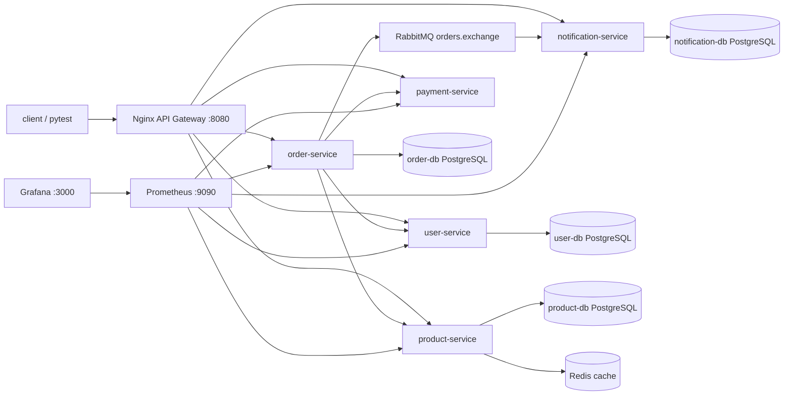

# microservices-qa-lab

Local microservices testing laboratory for QA Automation Engineers.

The project demonstrates API testing, integration testing, contract checks, asynchronous RabbitMQ messaging, Redis cache behavior, resilience scenarios, gateway routing, service-owned databases, and structured request tracing.

No paid cloud services are required.

## Architecture



## Services

| Service | Responsibility |
| --- | --- |
| `user-service` | Owns users, status, and email uniqueness. |
| `product-service` | Owns catalog, stock, and Redis product cache. |
| `order-service` | Orchestrates user/product/payment checks and publishes order events. |
| `payment-service` | Simulates payment success, failure, timeout, and random behavior. |
| `notification-service` | Consumes order events and stores idempotent notifications. |
| `nginx` | Exposes one public API surface at `http://localhost:8080`. |
| `prometheus` | Scrapes service `/metrics` endpoints. |
| `grafana` | Provides preconfigured dashboards backed by Prometheus. |

## Run Locally

From `C:\microservices-qa-lab`:

```bash
docker compose up --build
```

Gateway:

```text
http://localhost:8080
```

QA Dashboard:

```text
http://localhost:8080
```

The dashboard can create users, products, orders, switch payment modes, check cache headers, and view notifications through the same gateway routes used by the tests.

Customer Storefront:

```text
http://localhost:8080/store.html
```

The storefront is a customer-facing shop UI backed by the same user, product, order, payment, and notification services.

RabbitMQ Management UI:

```text
http://localhost:15672
guest / guest
```

Grafana:

```text
http://localhost:3000
admin / admin
```

Prometheus:

```text
http://localhost:9090
```

## Stop And Reset

```bash
docker compose down
```

Remove volumes and reset all databases/messages:

```bash
docker compose down -v
```

## Run Tests

Install test dependencies on the host:

```bash
pip install -r requirements-dev.txt
```

Run all tests:

```bash
pytest
```

Run by layer:

```bash
pytest -m api
pytest -m integration
pytest -m contract
pytest -m async_events
pytest -m cache
pytest -m resilience
```

Run tests inside Docker Compose:

```bash
docker compose -f docker-compose.yml -f docker-compose.test.yml run --rm test-runner
```

## Manual QA Learning Plan

For manual practice before automation, use:

```text
docs/manual-qa-mastery-plan.md
```

It contains a step-by-step learning path, manual testing tasks, expected artifacts, and interview questions with answers.

Detailed lesson files are available here:

```text
docs/training/README.md
```

The `docs/training` folder contains separate lessons with competencies, exact tester actions, investigation points, expected evidence, interview questions, main answers, and alternative answer variants.

## Fault Injection CLI

Use the fault injection utility to model production-like failures locally:

```bash
py -3 scripts\fault_lab.py list
py -3 scripts\fault_lab.py enable payment-timeout
py -3 scripts\fault_lab.py disable payment-timeout
py -3 scripts\fault_lab.py restore-all
```

The full playbook is here:

```text
docs/fault-injection-playbook.md
```

## Public Gateway Routes

| Route | Upstream |
| --- | --- |
| `/api/users` | `user-service /users` |
| `/api/products` | `product-service /products` |
| `/api/orders` | `order-service /orders` |
| `/api/payments` | `payment-service /payments` |
| `/api/payments/test-controls/payment-mode` | `payment-service /test-controls/payment-mode` |
| `/api/notifications` | `notification-service /notifications` |

Each service also exposes `/health`, `/ready`, and `/metrics`; through the gateway use routes like `/api/orders/ready` and `/api/orders/metrics`.

## Observability

Prometheus scrapes these internal targets every 5 seconds:

```text
user-service:8000/metrics
product-service:8000/metrics
order-service:8000/metrics
payment-service:8000/metrics
notification-service:8000/metrics
```

Grafana is provisioned automatically with the `Prometheus` datasource and the `Microservices QA Lab Overview` dashboard.

## Useful Commands

```bash
docker compose logs -f order-service
docker compose logs -f notification-service
docker compose ps
python scripts/seed-data.py
curl http://localhost:8080/api/orders/metrics
```

## QA Features

- Payment test control: `success`, `failure`, `timeout`, `random`.
- Product cache visibility through `X-Cache: HIT` and `X-Cache: MISS`.
- RabbitMQ event topology with durable queue and DLQ.
- Notification idempotency through unique `event_id`.
- Polling-based eventual consistency tests.
- Pydantic contract models for user, product, and order event payloads.
- Structured JSON logs with `X-Request-ID`.
- Prometheus metrics and a preconfigured Grafana overview dashboard.

## Known Limitations

- Database schema is created with SQLAlchemy `create_all`; Alembic is intentionally omitted in this first version.
- Product stock is validated during order creation but not reserved or decremented.
- Payment records are stored in memory because the service is a controlled testing dependency.
- Resilience is visible and deterministic, but there is no circuit breaker library yet.
- Logs are available through Docker JSON stdout; centralized log aggregation is intentionally left for a later Loki or ELK step.

## Suggested Next Improvements

- Add a Kafka variant of the async flow.
- Add Pact contract tests.
- Add OpenTelemetry tracing.
- Add Loki log aggregation.
- Add Sentry error tracking.
- Add GitHub Actions.
- Add richer Docker Compose test profiles.
- Add mutation and fault-injection scenarios.
