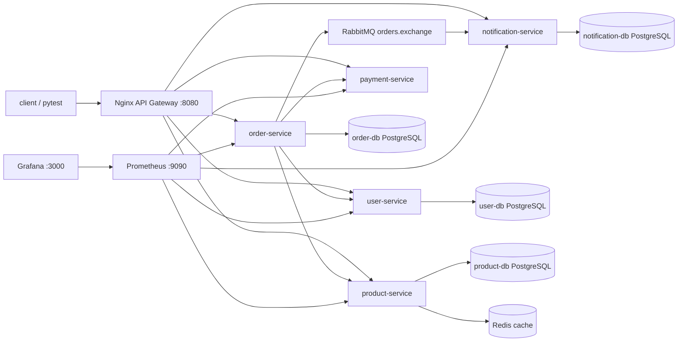

# microservices-qa-lab

Локальный учебный проект для тестировщика, который хочет разобраться в реальном микросервисном приложении.

Это небольшой интернет-магазин с пользовательским интерфейсом, QA Dashboard, API Gateway, несколькими backend-сервисами, базами данных, Redis, RabbitMQ, Prometheus и Grafana. Проект можно запускать полностью на своем компьютере через Docker Compose. Платные облачные сервисы не нужны.

На этом проекте можно тренировать:

- ручное тестирование UI и API;
- интеграционное тестирование нескольких сервисов;
- проверку контрактов запросов и ответов;
- работу с RabbitMQ и асинхронными событиями;
- проверку Redis cache;
- диагностику через логи, метрики, Prometheus и Grafana;
- моделирование поломок через fault injection;
- подготовку к собеседованию QA / QA Automation.

## Архитектура



Пользователь открывает магазин через `nginx`. `nginx` работает как API Gateway: принимает внешние запросы на `http://localhost:8080` и отправляет их в нужный сервис.

Например:

- создание пользователя идет в `user-service`;
- каталог товаров идет в `product-service`;
- оформление заказа идет в `order-service`;
- платеж проверяется через `payment-service`;
- уведомление о заказе создается через `notification-service` после события в RabbitMQ.

## Сервисы

| Сервис | За что отвечает |
| --- | --- |
| `user-service` | Пользователи, email, имя, статус аккаунта. |
| `product-service` | Каталог товаров, цены, остатки на складе, Redis cache. |
| `order-service` | Создание заказов, проверка пользователя, товаров и платежа. |
| `payment-service` | Тестовая платежная система: success, failure, timeout, random. |
| `notification-service` | Читает события заказов из RabbitMQ и создает уведомления. |
| `nginx` | Единая точка входа в приложение: `http://localhost:8080`. |
| `prometheus` | Собирает метрики сервисов с `/metrics`. |
| `grafana` | Показывает метрики в готовом dashboard. |

## Быстрый запуск

Перейди в папку проекта. Если работаешь с текущей локальной папкой, команда будет такой:

```powershell
cd C:\microservices-qa-lab
```

Если ты клонировал репозиторий из GitHub в другое место, перейди в свою папку проекта.

И запусти все сервисы:

```powershell
docker compose up --build
```

Если хочешь запустить в фоне, используй:

```powershell
docker compose up -d --build
```

После запуска открой:

```text
http://localhost:8080
```

Это главный вход через gateway.

## Пользовательский магазин

Пользовательский интерфейс магазина:

```text
http://localhost:8080/store.html
```

В нем можно:

- посмотреть каталог товаров;
- создать аккаунт покупателя;
- добавить товары в корзину;
- оформить заказ;
- посмотреть историю заказов;
- увидеть статус заказа;
- проверить, что обычный пользователь видит систему как реальный интернет-магазин.

Этот UI работает через те же backend-сервисы, что и тесты: `user-service`, `product-service`, `order-service`, `payment-service` и `notification-service`.

## QA Dashboard

QA Dashboard:

```text
http://localhost:8080
```

Он нужен тестировщику. Через него можно быстро:

- создавать пользователей;
- создавать товары;
- создавать заказы;
- переключать режим платежей;
- проверять Redis cache через `X-Cache`;
- смотреть уведомления;
- открывать Swagger UI сервисов;
- переходить в RabbitMQ, Grafana и Prometheus.

## Полезные web-инструменты

RabbitMQ Management UI:

```text
http://localhost:15672
guest / guest
```

RabbitMQ нужен, чтобы смотреть очереди и события заказов.

Grafana:

```text
http://localhost:3000
admin / admin
```

Grafana нужна, чтобы смотреть dashboard с метриками: количество запросов, ошибки, latency и состояние сервисов.

Prometheus:

```text
http://localhost:9090
```

Prometheus собирает метрики с сервисов и хранит их для Grafana.

## Остановка и полный сброс

Остановить контейнеры:

```powershell
docker compose down
```

Остановить контейнеры и удалить все данные из баз, Redis и RabbitMQ:

```powershell
docker compose down -v
```

Команда `down -v` полезна, когда нужно начать с полностью чистого стенда.

## Проверка, что стенд живой

Быстрая smoke-проверка:

```powershell
py -3 scripts\fault_lab.py smoke
```

Она проверяет gateway, все backend-сервисы, Prometheus и Grafana.

Ожидаемый результат - все строки должны вернуться со статусом `200`.

## Установка на VPS

Проект можно развернуть на обычном VPS через Docker Compose. Для учебного стенда на 4-5 человек лучше не брать самый слабый сервер, потому что здесь одновременно работают backend-сервисы, PostgreSQL, Redis, RabbitMQ, Prometheus и Grafana.

### Рекомендуемые характеристики VPS

| Вариант | CPU | RAM | Диск | Когда подходит |
| --- | ---: | ---: | ---: | --- |
| Минимум | 2 vCPU | 4 GB | 40 GB SSD | Стенд запустится, но запас будет маленький. |
| Рекомендуется | 4 vCPU | 8 GB | 80 GB SSD/NVMe | Нормальный вариант для 4-5 человек. |
| С запасом | 4-6 vCPU | 12-16 GB | 100+ GB SSD/NVMe | Если часто гонять тесты, fault injection и долго хранить метрики. |

Рекомендуемая ОС:

```text
Ubuntu Server 22.04 LTS или 24.04 LTS
```

Рекомендуемая архитектура:

```text
x86_64 / amd64
```

### Что нужно установить на сервер

На чистом Ubuntu Server установи базовые пакеты, Docker и Docker Compose plugin:

```bash
sudo apt update
sudo apt install -y ca-certificates curl git ufw gnupg

sudo install -m 0755 -d /etc/apt/keyrings
sudo curl -fsSL https://download.docker.com/linux/ubuntu/gpg -o /etc/apt/keyrings/docker.asc
sudo chmod a+r /etc/apt/keyrings/docker.asc

echo \
  "deb [arch=$(dpkg --print-architecture) signed-by=/etc/apt/keyrings/docker.asc] https://download.docker.com/linux/ubuntu \
  $(. /etc/os-release && echo "$VERSION_CODENAME") stable" | \
  sudo tee /etc/apt/sources.list.d/docker.list > /dev/null

sudo apt update
sudo apt install -y docker-ce docker-ce-cli containerd.io docker-buildx-plugin docker-compose-plugin
```

Чтобы запускать Docker без `sudo`, добавь своего пользователя в группу `docker`:

```bash
sudo usermod -aG docker $USER
```

После этого выйди из SSH и зайди снова.

Проверь установку:

```bash
docker --version
docker compose version
```

### Рекомендуемый swap

На VPS с 4-8 GB RAM полезно добавить swap, чтобы сервер не завершал процессы резко при пиковом потреблении памяти:

```bash
sudo fallocate -l 4G /swapfile
sudo chmod 600 /swapfile
sudo mkswap /swapfile
sudo swapon /swapfile
echo '/swapfile none swap sw 0 0' | sudo tee -a /etc/fstab
```

Проверить:

```bash
free -h
```

### Вариант 1. Быстрый учебный запуск по IP

Этот вариант подходит, если сервер нужен только для обучения и ты готов открывать приложение по IP и порту `8080`.

Склонируй репозиторий:

```bash
cd /opt
sudo git clone https://github.com/andraksel/micro-service-app.git
sudo chown -R $USER:$USER /opt/micro-service-app
cd /opt/micro-service-app
```

Запусти стенд:

```bash
docker compose up -d --build
```

Проверь контейнеры:

```bash
docker compose ps
```

Открой в браузере:

```text
http://SERVER_IP:8080
http://SERVER_IP:8080/store.html
```

Где `SERVER_IP` - публичный IP твоего VPS.

Для такого варианта достаточно открыть firewall-порты:

```bash
sudo ufw allow OpenSSH
sudo ufw allow 8080/tcp
sudo ufw enable
sudo ufw status
```

Минус этого варианта: нет HTTPS и приложение открывается по нестандартному порту.

### Вариант 2. Нормальный вариант с доменом и HTTPS

Этот вариант лучше, если стендом будут пользоваться несколько человек.

Идея:

- приложение внутри сервера работает на `localhost:8080`;
- наружу открыты только `80` и `443`;
- домен ведет на VPS;
- внешний reverse proxy выдает HTTPS через Let's Encrypt.

Можно использовать Caddy, Nginx Proxy Manager, Traefik или обычный Nginx. Самый простой вариант - Caddy.

Установи Caddy:

```bash
sudo apt install -y debian-keyring debian-archive-keyring apt-transport-https
curl -1sLf 'https://dl.cloudsmith.io/public/caddy/stable/gpg.key' | sudo gpg --dearmor -o /usr/share/keyrings/caddy-stable-archive-keyring.gpg
curl -1sLf 'https://dl.cloudsmith.io/public/caddy/stable/debian.deb.txt' | sudo tee /etc/apt/sources.list.d/caddy-stable.list
sudo apt update
sudo apt install -y caddy
```

Пример `/etc/caddy/Caddyfile`:

```text
qa-shop.example.com {
    reverse_proxy 127.0.0.1:8080
}
```

Перезапусти Caddy:

```bash
sudo systemctl reload caddy
```

Firewall для варианта с HTTPS:

```bash
sudo ufw allow OpenSSH
sudo ufw allow 80/tcp
sudo ufw allow 443/tcp
sudo ufw enable
sudo ufw status
```

После настройки открой:

```text
https://qa-shop.example.com
https://qa-shop.example.com/store.html
```

Важно: замени `qa-shop.example.com` на свой реальный домен, который указывает A-записью на IP сервера.

### Вариант 3. Закрытый учебный стенд без публичного доступа

Если не хочешь выставлять приложение в интернет, можно оставить порты закрытыми и ходить на стенд через SSH tunnel.

На сервере запускаешь:

```bash
docker compose up -d --build
```

На своем компьютере открываешь tunnel:

```bash
ssh -L 8080:localhost:8080 user@SERVER_IP
```

После этого локально открываешь:

```text
http://localhost:8080
http://localhost:8080/store.html
```

Этот вариант безопаснее для учебного стенда, потому что наружу открыт только SSH.

### Что не стоит открывать наружу

Не рекомендуется публично открывать без защиты:

- RabbitMQ Management UI: `15672`;
- Prometheus: `9090`;
- Grafana: `3000`;
- PostgreSQL;
- Redis;
- внутренние порты backend-сервисов `8001-8005`.

Если нужен доступ к Grafana или RabbitMQ через интернет, лучше:

- закрыть их за VPN;
- или поставить reverse proxy с Basic Auth;
- или ограничить доступ по IP;
- или использовать SSH tunnel.

Для учебного стенда минимально наружу достаточно открыть:

```text
22/tcp  - SSH
80/tcp  - HTTP, если используешь домен
443/tcp - HTTPS, если используешь домен
8080/tcp - только для простого учебного запуска без reverse proxy
```

### Обновление приложения на VPS

Когда в репозитории появились новые изменения:

```bash
cd /opt/micro-service-app
git pull
docker compose up -d --build
```

Проверить состояние:

```bash
docker compose ps
```

Посмотреть логи:

```bash
docker compose logs -f nginx
docker compose logs -f order-service
```

### Остановка приложения на VPS

Остановить контейнеры:

```bash
cd /opt/micro-service-app
docker compose down
```

Полностью удалить данные стенда:

```bash
docker compose down -v
```

Команда `down -v` удалит Docker volumes с PostgreSQL, Redis, RabbitMQ, Prometheus и Grafana. Используй ее только когда точно нужен полный сброс.

### Бэкапы

Если стенд используется только для обучения, данные можно сбрасывать через `docker compose down -v`. Если данные важны, нужно регулярно бэкапить PostgreSQL volumes или делать `pg_dump` для баз.

Минимально важные данные:

- пользователи;
- товары;
- заказы;
- уведомления;
- настройки Grafana, если ты менял dashboard.

## Запуск тестов

Установить зависимости для тестов на хосте:

```powershell
pip install -r requirements-dev.txt
```

Запустить все тесты:

```powershell
pytest
```

Запустить тесты по слоям:

```powershell
pytest -m api
pytest -m integration
pytest -m contract
pytest -m async_events
pytest -m cache
pytest -m resilience
```

Запустить тесты внутри Docker Compose:

```powershell
docker compose -f docker-compose.yml -f docker-compose.test.yml run --rm test-runner
```

## Учебный план для ручного QA

План обучения без автоматизации:

```text
docs/manual-qa-mastery-plan.md
```

В нем описано, как проходить проект руками: что проверять, какие артефакты готовить, какие вопросы могут быть на собеседовании и как на них отвечать.

Подробные уроки лежат здесь:

```text
docs/training/README.md
```

В папке `docs/training` есть отдельные уроки. В каждом уроке расписано:

- какие компетенции ты получишь;
- что именно делать тестировщику;
- куда смотреть в UI, API, Docker, RabbitMQ, Grafana и логах;
- почему эти проверки важны;
- какие evidence собирать;
- какие вопросы могут быть на собеседовании;
- как отвечать основным и альтернативным способом.

## Fault Injection CLI

В проекте есть CLI-утилита, которая умеет намеренно ломать приложение. Это нужно для тренировки реальных production-ситуаций.

Посмотреть список поломок:

```powershell
py -3 scripts\fault_lab.py list
```

Включить поломку payment timeout:

```powershell
py -3 scripts\fault_lab.py enable payment-timeout
```

Выключить поломку:

```powershell
py -3 scripts\fault_lab.py disable payment-timeout
```

Вернуть систему в рабочее состояние:

```powershell
py -3 scripts\fault_lab.py restore-all
```

Подробный playbook по поломкам:

```text
docs/fault-injection-playbook.md
```

## Основные gateway routes

Все внешние API-запросы идут через `nginx` на `http://localhost:8080`.

| Route | Куда проксируется |
| --- | --- |
| `/api/users` | `user-service /users` |
| `/api/products` | `product-service /products` |
| `/api/orders` | `order-service /orders` |
| `/api/payments` | `payment-service /payments` |
| `/api/payments/test-controls/payment-mode` | `payment-service /test-controls/payment-mode` |
| `/api/notifications` | `notification-service /notifications` |

У каждого сервиса есть:

- `/health` - процесс жив;
- `/ready` - сервис готов принимать рабочие запросы;
- `/metrics` - метрики для Prometheus.

Через gateway это выглядит так:

```text
http://localhost:8080/api/orders/ready
http://localhost:8080/api/orders/metrics
```

## Наблюдаемость

Prometheus каждые 5 секунд собирает метрики с внутренних сервисов:

```text
user-service:8000/metrics
product-service:8000/metrics
order-service:8000/metrics
payment-service:8000/metrics
notification-service:8000/metrics
```

Grafana автоматически получает datasource `Prometheus` и готовый dashboard `Microservices QA Lab Overview`.

Для тестировщика это полезно, потому что можно связать действие пользователя с техническим эффектом:

- создали заказ - выросло количество запросов;
- включили payment timeout - выросла latency;
- остановили сервис - появились ошибки;
- восстановили стенд - метрики вернулись к норме.

## Полезные команды

Посмотреть логи `order-service`:

```powershell
docker compose logs -f order-service
```

Посмотреть логи `notification-service`:

```powershell
docker compose logs -f notification-service
```

Проверить контейнеры:

```powershell
docker compose ps
```

Создать тестовые данные:

```powershell
python scripts/seed-data.py
```

Посмотреть метрики заказов через gateway:

```powershell
curl http://localhost:8080/api/orders/metrics
```

## Что можно тренировать как QA

- Проверка UI магазина от лица пользователя.
- Проверка QA Dashboard как внутреннего инструмента тестировщика.
- API-тестирование пользователей, товаров, заказов, платежей и уведомлений.
- Проверка status codes: `200`, `201`, `400`, `404`, `409`, `422`, `500`.
- Проверка Redis cache через `X-Cache: HIT` и `X-Cache: MISS`.
- Проверка RabbitMQ events, очередей и DLQ.
- Проверка eventual consistency: заказ создан сразу, уведомление приходит позже.
- Проверка идемпотентности уведомлений через уникальный `event_id`.
- Проверка логов с `X-Request-ID`.
- Проверка метрик Prometheus и dashboard в Grafana.
- Проверка отказов через fault injection.
- Подготовка тестовой документации: test plan, checklist, test cases, bug reports, test summary.

## Известные ограничения

- Схемы баз создаются через SQLAlchemy `create_all`; Alembic пока не используется.
- Остаток товара проверяется при создании заказа, но не резервируется и не уменьшается.
- `payment-service` хранит платежи в памяти, потому что это учебная контролируемая зависимость.
- Отказы моделируются детерминированно, но circuit breaker библиотека пока не добавлена.
- Логи доступны через Docker stdout; централизованный сбор логов через Loki или ELK можно добавить позже.

## Возможные следующие улучшения

- Добавить Kafka-вариант асинхронного flow.
- Добавить Pact contract tests.
- Добавить OpenTelemetry tracing.
- Добавить Loki для логов.
- Добавить Sentry для ошибок frontend/backend.
- Добавить GitHub Actions.
- Добавить Docker Compose profiles для разных режимов запуска.
- Добавить больше mutation и fault-injection сценариев.
